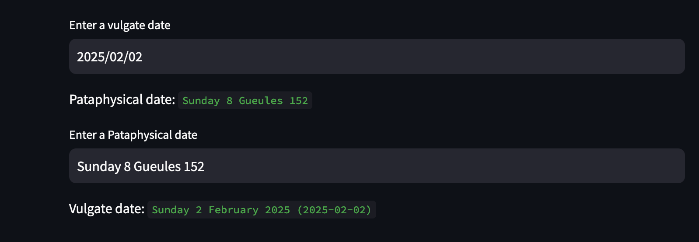

# Background
This repo is a quick Python implementation of the
['Pataphysical calendar](https://en.wikipedia.org/wiki/'Pataphysics#Pataphysical_calendar).

# Quickstart
uv
```
uv pip install requirements.txt
uv run streamlit run app.py
```

pip
```
python -m venv .venv
source .venv/bin/activate
pip install requirements.txt
streamlit run app.py
```


